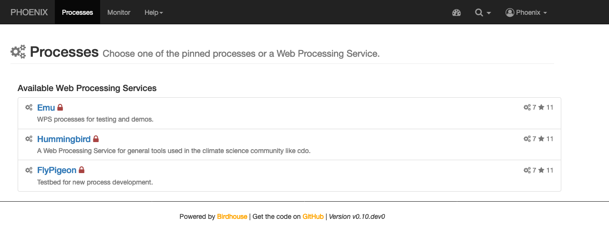
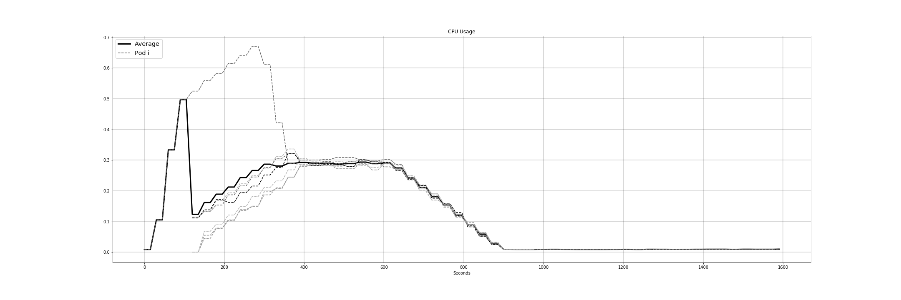
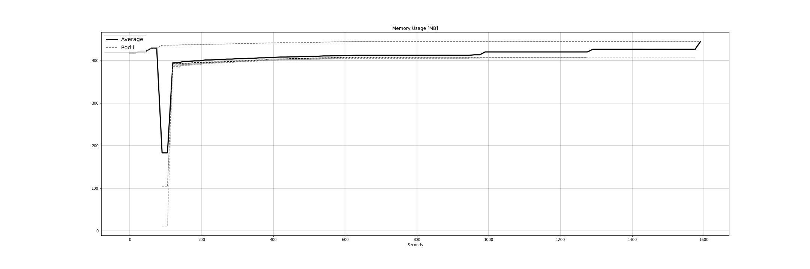
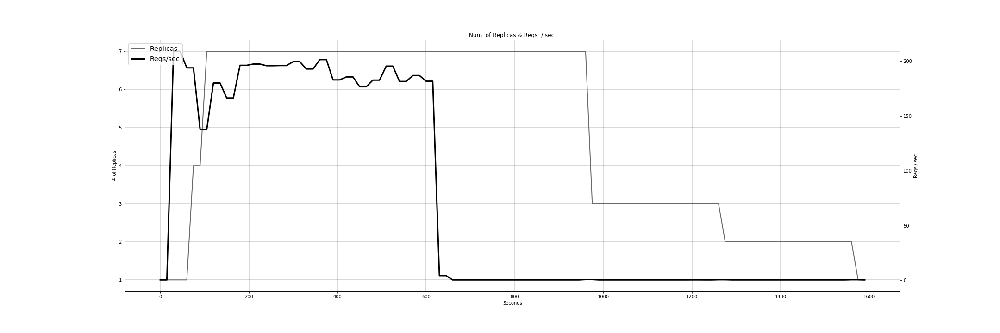
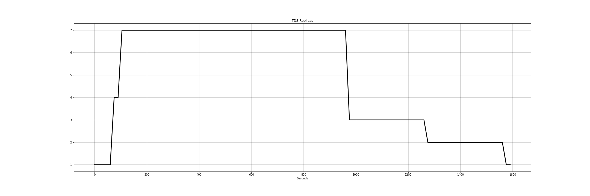
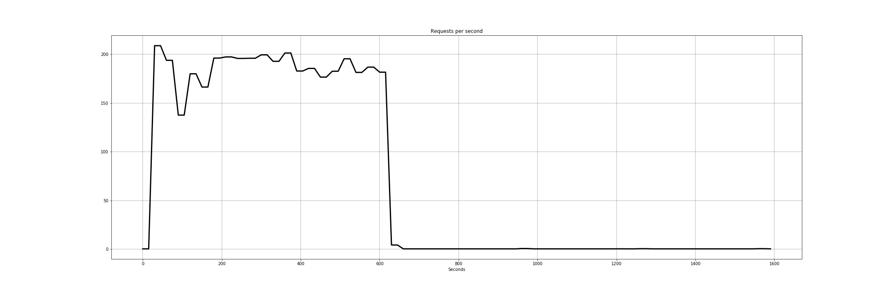

# Birdhouse Helm Chart
This Helm Chart installs some of the components of the [Birdhouse project](https://birdhouse.readthedocs.io/en/latest/) into a Kubernetes cluster.
In this deployment [Phoenix](https://pyramid-phoenix.readthedocs.io/en/latest/) acts as the WPS web-based client to [Emu](https://emu.readthedocs.io/en/latest/), [Hummingbird](https://birdhouse-hummingbird.readthedocs.io/en/latest/), [FlyingPigeon](https://flyingpigeon.readthedocs.io/en/latest/) or other WPS you may want to deploy and register into Phoenix.


## TL;DR
```
git clone https://github.com/Pablo-CC/birdhouse-helm.git
kubectl create namespace birdhouse
helm install --name birdhouse --namespace birdhouse .
```

## Autoscaling
Kubernetes' Horizontal Pod Autoscaler is used for the autoscaling of the frontend (i.e. Phoenix). The following figures represent the results of this during a load test:

### CPU Usage

### Memory Usage

### Replicas + Requests

### Replicas

### Requests per second


